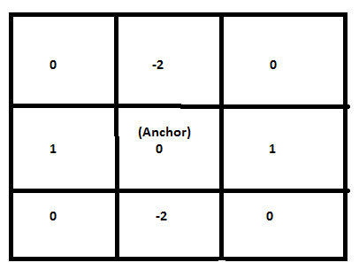
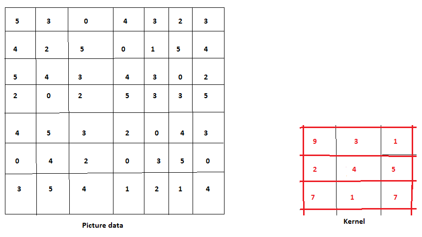
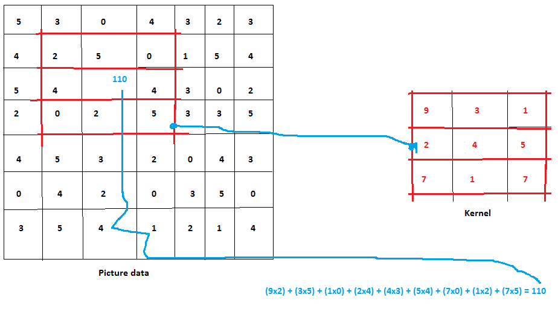

**Image Processing, how to apply a kernel to an image**

Following couple of files are examples of how you can apply a small matrix to whole of a picture pixel by pixel. This small matrix is also sometimes called convolution kernel.  Matrix is made up of cells and in each cell a number(a weight) is stored. Out of all cells one cell is called anchor cell or anchor point. The matrix is used as sliding window, we weigh each pixel under the window and when all pixels under the window gets weighed we store the result in the anchor cell and then, we slide the window over the fresh set of pixels and repeat the whole process.

 

